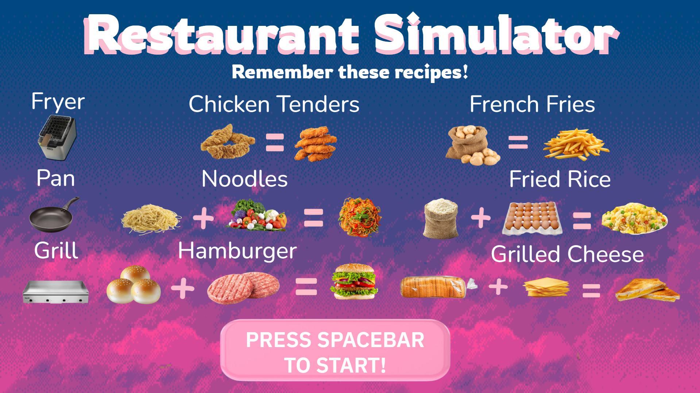

# Project Title: Restaurant Simulator
## CS110 Final Project Fall 2024

## Team Members
Logan Mok
Reggie Juance

***

## Project Description

The game will consist of varying ingredients and recipes for the user to create, and must fulfill various orders asked by customers.

***    

## GUI Design

### Initial Design

### Final Design

## Program Design

### Features

1. Multiple Ingredients
2. Variety in Recipes
3. Variety in Appliances
4. Customer Order
5. Random Customer Order

### Classes
    - Button: create a general button to be clicked
    - Customer: creates a customer and order
    - Timer: Keeps track of time for customers to spawn
    
## ATP
Test Case 1: Ingredient
**Test Description:**  
Verify that the player can click on an ingredient button, and the ingredient will be placed on the corresponding appliance.

**Test Steps:**
1. Launch the game.
2. Locate an ingredient button on the screen (e.g., "Vegetables").
3. Click the ingredient button.
4. Observe the pan (or other appliances where ingredient should go)
5. Check that the clicked ingredient appears on the pan.
6. Repeat the process with different ingredients 

**Expected Outcome:**  
When the player clicks on any ingredient button, the respective ingredient should appear on the pan or cooking area. Nothing should cause the ingredient to appear unless explicitly clicked.
______________________________________________________________________________________________________________________________________________________________________________________________
Test Case 2: Cooking
**Test Description:**  
Verify that the GUI updates after adding new ingredients.

**Test Steps:**
1. Launch the game.
2. Follow a recipe that corresponds to a specific appliance.
3. Click the first ingredient of a recipe.
4. Click the second ingredient of the recipe.
5. Make sure the ingredient behind disappears.

**Expected Outcome**
When the player clicks the next ingredient of the process, the ingredient behind should disappear and update with the next step  of the recipe.
______________________________________________________________________________________________________________________________________________________________________________________________
Test Case 3: Recipe Completion
**Test Description:**  

**Test Steps:**
Verify that ingredients added in a specific order will be able to form to a completed meal.
1. Launch the game.
2. Follow a recipe that corresponds to a specific appliance.
3. Click the first ingredient of a recipe.
4. Click the second ingredient of the recipe.
5. Click on the appliance.
6. Make sure that the image updates with the correct corresponding completed meal.

**Expected Outcome**
When the player adds all the necessary ingredients, the ingredients should combine when clicking on the appliance with the completed meal.
______________________________________________________________________________________________________________________________________________________________________________________________
Test Case 4: Ingredients Out of Order
**Test Description:**

**Test Steps:**
Verify that ingredients cannot be used out of order.
1. Launch the game
2. Press an ingredient that comes second in a recipe.
3. Verify that nothing happens. (no screen update)

**Expected Outcome**
If a player clicks an ingredient that corresponds to the second step of a multi-step recipe, nothing will occur.
______________________________________________________________________________________________________________________________________________________________________________________________
Test Case 5: Customer Order
**Test Description**
Verify that a customer can receive an order.

**Test Steps:**
1. Launch the game.
2. Follow a recipe that corresponds to a specific appliance.
3. Click the first ingredient of a recipe.
4. Click the second ingredient of the recipe.
5. Click on the appliance.
6. Click on the newly created completed dish.

**Expected Outcome**
The customer should disappear once their order is completely fulfilled.