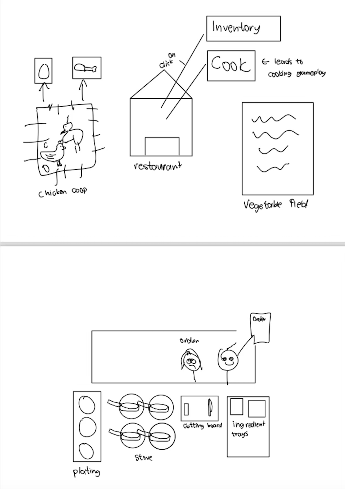

:warning: Everything between << >> needs to be replaced (remove << >> after replacing)

# << Project Title >>
## CS110 Final Project Fall 2024

## Team Members
Logan Mok
Reggie Juance

***

## Project Description

The game will be a town building and farming simulator revolving around a restaurant. The ingredients collected can be used in the cooking-rush style gameplay, which is rewarded with money that can be used to continually upgrade the restaurant in all of its capabilities.

***    

## GUI Design

### Initial Design

### Final Design

## Program Design

### Features

1. Tutorial
2. Collect Resources
3. Cook with Resources
4. Upgrade Features
5. Currency

### Classes

- << You should have a list of each of your classes with a description >>

## ATP

| Step                 |Procedure             |Expected Results                   |
|----------------------|:--------------------:|----------------------------------:|
|  1                   | Run Counter Program  |GUI window appears with count = 0  |
|  2                   | click count button   | display changes to count = 1      |
etc...
